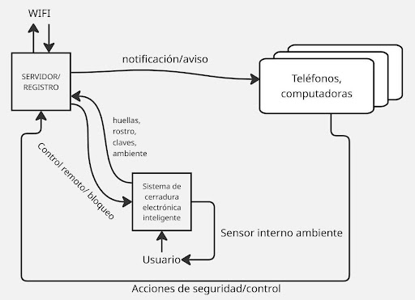
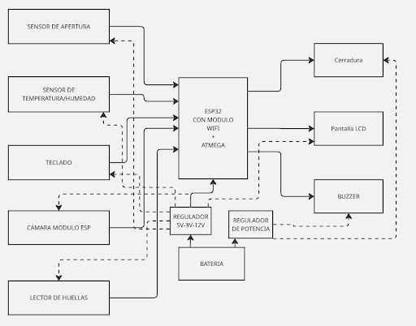
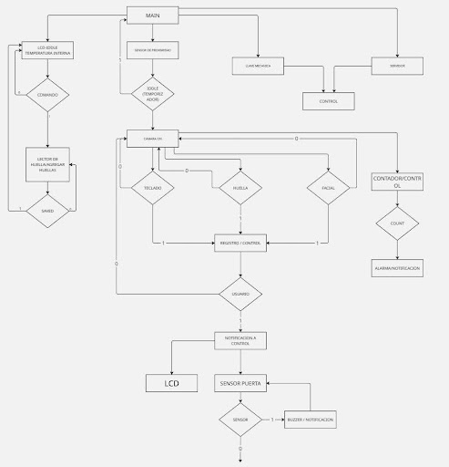
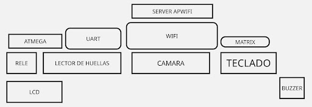

**Documento de Diseño – Sistemas Embebidos**  
**Proyecto:** Cerradura electrónica con aplicaciones domóticas para acceso a espacios delicados  
**Integrantes:** Garate Rivera Felix Javier – Tomala Mena Emilio

1. **Introducción**

Las cerraduras electrónicas permiten mejorar el control de acceso mediante métodos de autenticación y monitoreo, aunque las soluciones comerciales pueden presentar costos elevados de adquisición e instalación. Este proyecto propone una cerradura electrónica de bajo costo basada en un sistema embebido, capaz de integrar autenticación mediante huella, reconocimiento facial y teclado. El sistema empleará un ESP32 para gestionar las funciones principales, comunicación Wi-Fi y servidor, complementado con sensores y actuadores para controlar la cerradura y generar alertas de seguridad.

Con lo anterior presente, los objetivos de este proyecto son los siguientes:

- Evaluar la conveniencia de instalación de un solo dispositivo inteligente en comparación con la instalación invasiva de cerraduras electrónicas en el mercado actual.
- Comprobar la efectividad de los comandos y funciones del servidor propio del dispositivo utilizados para controlar la cerradura y enviar alertas a los usuarios.

2. **Alcance y limitaciones**

El dispositivo consiste en un sistema embebido para el control de una cerradura eléctrica, utilizando un ESP32 como controlador principal para gestionar la conexión Wi-Fi, el servidor y los métodos de autenticación mediante lector de huellas, cámara y teclado. El sistema contará además con una pantalla LCD para la interacción con el usuario, sensores para supervisar las condiciones del entorno y actuadores para el control de la cerradura y generación de alertas. Estas funciones corresponden al alcance principal del prototipo planteado en el proyecto.

Como limitación, el prototipo depende de la alimentación eléctrica y de la conexión a Internet para determinadas funciones de monitoreo y control remoto. Sin embargo, para evitar que una falla eléctrica, pérdida de conexión, incendio, sismo o bloqueo del sistema impida la evacuación, se incorporará un mecanismo local de apertura de emergencia desde el interior, independiente del ESP32, del servidor, de Internet y de la alimentación eléctrica. De esta manera, el bloqueo generado ante un intento de acceso no autorizado afectará únicamente el ingreso desde el exterior y no impedirá la salida de las personas desde el interior. Otras funciones adicionales, como la detección automática de humo o la integración con sistemas externos de emergencia, quedan fuera del alcance del prototipo.

3. **Diagramas**
<figure>
  
  <figcaption><i>Figura 1: Diagrama de Contexto.</i></figcaption>
</figure>
<figure>
  
  <figcaption><i>Figura 2: Diagrama de Bloques.</i></figcaption>
</figure>
<figure>
  
  <figcaption><i>Figura 3: Organigrama.</i></figcaption>
</figure>
<figure>
  
  <figcaption><i>Figura 4: Diagrama de Niveles.</i></figcaption>
</figure>

4. **Alternativas de diseño**

Como alternativa se considera separar los elementos de control en una caja interna y mantener externamente solo los dispositivos de autenticación, aumentando la protección ante manipulaciones. Otra opción sería integrar completamente el sistema en la puerta, proporcionando mayor seguridad, pero incrementando considerablemente el costo y la complejidad. Estas alternativas no serán implementadas en el prototipo, ya que se prioriza una solución funcional, adaptable a cerraduras eléctricas comerciales y de menor costo.

5. **Plan de prueba y validación**

La validación del prototipo se realizará mediante casos de prueba para comprobar sus principales funciones. Se probarán los métodos de autenticación mediante contraseña, huella y reconocimiento facial, verificando que los usuarios autorizados puedan acceder y que los intentos no autorizados sean rechazados. Se realizarán 10 intentos por método, considerando satisfactorio un porcentaje de reconocimiento correcto igual o superior al 90 %, y se medirá el tiempo desde una autenticación válida hasta el accionamiento de la cerradura, estableciendo como criterio un tiempo de respuesta máximo de 2 segundos. También se desconectará la conexión a Internet para verificar que la autenticación local continúe funcionando y se interrumpirá la alimentación para comprobar que el mecanismo local de emergencia permita la apertura desde el interior sin depender del ESP32, servidor, Internet o energía eléctrica. Estos criterios permitirán determinar de forma medible si el prototipo cumple con las funciones propuestas.

6. **Consideraciones éticas**

El sistema manejará información sensible, como huellas, imágenes y registros de acceso, por lo que estos datos deberán almacenarse y utilizarse únicamente para las funciones de autenticación y seguridad, restringiendo su acceso a usuarios autorizados. Además, el diseño deberá respetar la privacidad de las personas y evitar mecanismos que puedan representar un riesgo para usuarios o terceros. La solución busca mantener un equilibrio entre seguridad, privacidad, accesibilidad económica y compatibilidad con cerraduras comerciales existentes.

ENLACE DEL GITHUB:

<https://github.com/EATM2026/Cerradura_Electronica_con_aplicaciones_domoticas/blob/main/README.md>
